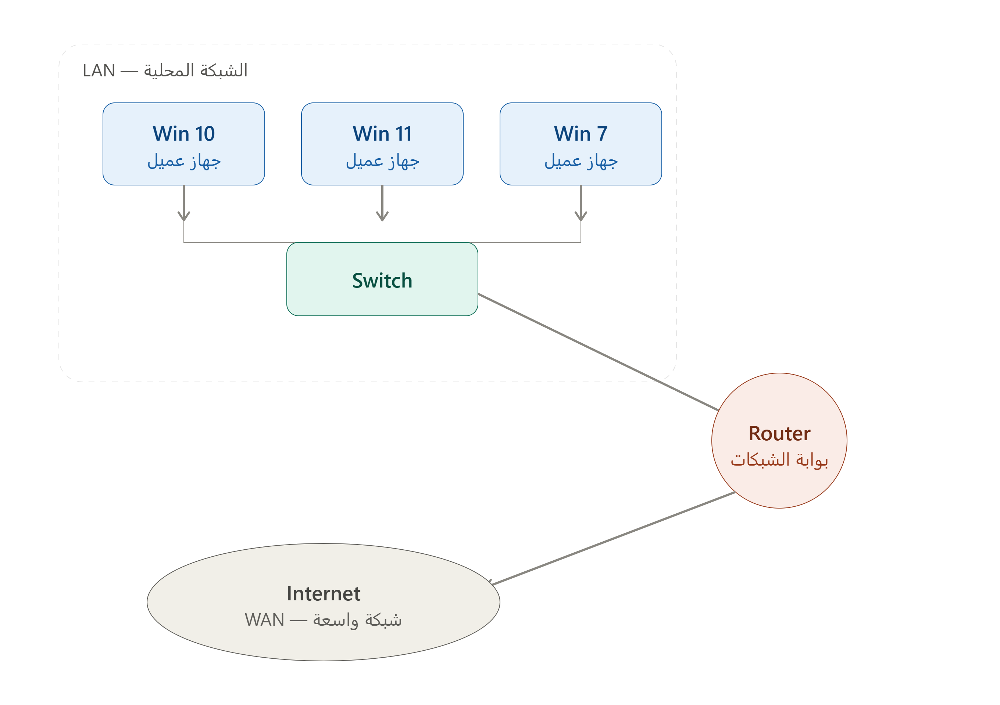

# Windows Server Administrator

* Network : Two devices or more connected together and share resource.

* LAN (Local Area Network) : three device connected by switch this is LAN when Connected it by router to other Network This is  WAN (Wide Area Network)
* Router : Connect and be a gate between networks.
---
* PC : Personal computer, contains: software and hardware.
* So the hardware are part of iron, need operating system to communicate between user and this hardware.

### [operating system] There is many type of operating system 

## In this course we study using Windows:
* Windows Client: Win 8, 10, 11
* Windows Server: 2019, 2022, 2025 (who used to control the computers and accounts of employees).

---
