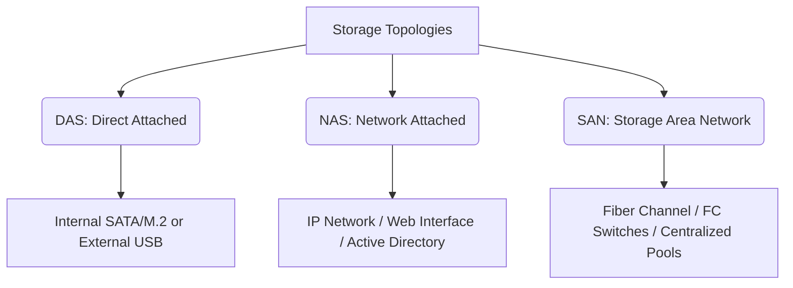
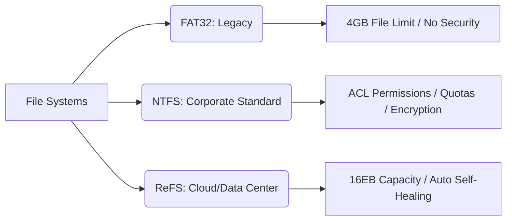

# Windows Server Storage Administration Guide

Welcome to the comprehensive guide on Windows Server Storage Administration. This documentation covers essential theoretical and practical concepts required to manage enterprise storage architectures, disk types, partition tables, file systems, and fault-tolerant RAID configurations.

---

## 📂 Repository Structure (Recommended)
```text
├── README.md               # Main course documentation (This file)
├── scripts/                # Automated deployment scripts
│   └── Initialize-Disks.ps1 # PowerShell automation scripts
└── assets/                 # Architecture & topology diagrams
```

---

## 🏛️ 1. Storage Architectures (DAS, NAS, SAN)

Modern enterprise environments rely on three main topologies to deliver data to host servers:



*   **DAS (Direct Attached Storage):** Storage directly connected to the server or client without an intermediary network (e.g., internal SSDs/HDDs via SATA/M.2 or external USB drives). It is simple and cost-effective but limited to the local machine and lacks the flexibility to be shared dynamically across multiple network servers.
*   **NAS (Network Attached Storage):** A dedicated hardware storage device with its own CPU and RAM that connects over the network via a standard IP address. It is managed via a web interface (HTTP/HTTPS) (e.g., QNAP systems) and supports domain joining (Active Directory) for user permissions. However, its transfer speed depends heavily on standard network traffic density.
*   **SAN (Storage Area Network):** A high-end, dedicated, high-speed storage network where servers connect to massive storage blocks (Storage Pools) using Fiber Channel switches and fiber optic cables. It offers rapid fiber speeds and massive capacity, making it ideal for virtualization environments (Hyper-V / VMware). If a host server crashes, virtual machines can instantly boot from another node because their data resides safely and centrally on the SAN.

---

## ⚡ 2. Evolution of Hard Drive Interfaces

| Interface Type | Infrastructure Use Case | Speed / Performance | Key Features |
| :--- | :--- | :--- | :--- |
| **IDE (PATA)** | Ancient Legacy (90s) | Extremely Slow | Uses physical ribbon cables and Master/Slave jumpers; high risk of pin damage. |
| **SATA** | Consumer & Standard Servers | Up to 600 MB/s (SATA 3) | Replaced IDE; introduced thin cables and **Hot-Swapping** (replacing drives on a live system). |
| **SCSI / SAS** | Enterprise Workloads | 12 Gb/s (SAS Modern) | Up to 400,000 IOPS; supports daisy-chaining up to 15 drives; engineered for 24/7 continuous operation. |
| **SSD / M.2 NVMe** | High-Performance Storage | PCIe Lane Speeds | Electronic flash chips with zero moving parts; eliminates mechanical needle wear; optimal for high-throughput databases. |

### 🚨 Server Drive LED Indicator Guide
When inspecting a physical server rack, the disk bay LED indicators communicate health statuses instantly:
*   🟢 **Solid Green:** The drive is healthy, online, and operating normally.
*   🟡 **Flashing/Solid Amber:** Warning state. The drive is experiencing bad sectors or firmware degradation and is approaching imminent failure.
*   🔴 **Solid Red:** Critical failure. The drive is completely dead, offline, and must be replaced immediately.

---

## 🎛️ 3. Basic Disks vs. Dynamic Disks

Windows Server categorizes physical storage into two software types:

*   **Basic Disks:** The traditional disk type. Supports Primary, Extended, and Logical partitions (up to 4 primary partitions). They **cannot** span volumes across different physical drives or support software-based RAID arrays.
*   **Dynamic Disks:** Advanced disk types designed for server environments. They improve overall input/output performance, allow easy volume extensions (spanning) across multiple separate physical disks, and fully support fault-tolerant software RAID configurations.

> ⚠️ **Data Integrity Warning:** You can safely convert a physical drive from **Basic to Dynamic** on-the-fly *without losing data*. However, converting a disk back from **Dynamic to Basic** *requires you to delete all existing volumes first*, which completely destroys all data on that drive.

---

## 🗺️ 4. Partition Tables (MBR vs. GPT)

Before formatting a disk, it must be initialized with a partition table style:

### Master Boot Record (MBR)
*   **Legacy standard** designed for older BIOS-based firmware.
*   Maximum partition capacity is strictly limited to **2 TB**.
*   Supports a maximum of 4 primary partitions (or 3 primary + 1 extended partition housing up to 23 logical drives).
*   **Single Point of Failure:** Contains only one boot sector; if this sector is corrupted, the entire disk partition map is lost.

### GUID Partition Table (GPT)
*   **Modern standard** mandatory for current UEFI-based systems.
*   Breaks past the 2 TB barrier, scaling capacities well into the Zettabytes.
*   Allows up to **128 primary partitions** natively without needing extended partition workarounds.
*   **High Redundancy:** Automatically creates and distributes backup copies of the partition table across the beginning, middle, and end of the drive, preventing data loss from single-sector corruption.

---

## 💾 5. File Systems (FAT32, NTFS, ReFS)



*   **FAT32:** Legacy file system. Limits maximum volume sizes to 32 GB and introduces a hard single-file size transfer limit of **4 GB** (e.g., copying a 5 GB operating system `.iso` file will fail despite having empty space). It entirely lacks the Security tab for access control permissions.
*   **NTFS:** The enterprise-grade standard for Microsoft ecosystems. Supports massive volume sizes and provides essential server management features: Security Permissions/Access Control Lists (ACLs), user-specific Disk Quotas, native File Encryption (EFS), and built-in Data Compression.
*   **ReFS (Resilient File System):** A cutting-edge file system engineered explicitly for massive cloud storage spaces and hyper-scale data centers. It handles singular file sizes up to an astronomical 16 Exabytes and runs background data integrity streams to automatically detect data corruption and fix system errors silently without requiring server downtime.

---

## 🛡️ 6. RAID Configurations (Redundant Array of Independent Disks)

*Note: In production environments, it is highly recommended to configure RAID arrays at the physical level via a hardware **RAID Controller Card** rather than using Windows software disk tools to achieve maximum processor efficiency.*

### RAID 0 (Striping)
*   **Minimum Drives:** 2
*   **Mechanism:** Splits and spreads data blocks alternately across drives (Block 1 to Drive 1, Block 2 to Drive 2).
*   **Pros/Cons:** Delivers **maximum read/write speeds** and fully utilizes 100% of raw disk capacity. However, it offers **zero fault tolerance**; if a single disk fails, the entire array is completely destroyed.

### RAID 1 (Mirroring)
*   **Minimum Drives:** 2
*   **Mechanism:** Simultaneously writes exact duplicate copies of data onto two drives.
*   **Pros/Cons:** Cuts raw storage efficiency by exactly 50% but offers **complete hardware fault tolerance**. If one disk dies, the mirror disk remains active instantly without system downtime (standard deployment for server operating system C: drives).

### RAID 5 (Striping with Parity)
*   **Minimum Drives:** 3
*   **Mechanism:** Distributes data blocks across all drives alongside mathematically calculated parity blocks interchangeably.
*   **Pros/Cons:** Optimally balances storage speed, capacity, and data security. It allows exactly **one drive to fail** without losing data. Replacing the bad drive triggers an automatic reconstruction utilizing the remaining parity equations. If two drives drop simultaneously, the data becomes unrecoverable.

### RAID 6 (Dual Distributed Parity)
*   **Minimum Drives:** 4
*   **Mechanism:** Operates exactly like RAID 5 but calculates and writes two independent sets of parity data.
*   **Pros/Cons:** Engineered to withstand **two simultaneous drive failures** without causing data loss or server crashes. Requires a compatible dedicated hardware controller.

### RAID 10 (1+0: Striping Mirrored Sets)
*   **Minimum Drives:** 4
*   **Mechanism:** Combines the high-speed striping performance of RAID 0 with the data-mirroring safety of RAID 1.
*   **Pros/Cons:** Mirrors pairs of drives first, then stripes data globally across those mirrored sets. This setup produces unmatched input/output read/write speeds for large transaction databases while maintaining resilient underlying hardware backups.

### 🔄 Hot Standby Configuration (e.g., RAID 5 + 1)
An elite enterprise mechanism where an extra, idle drive sits unallocated inside the server bay as a "Hot Spare". The moment the active RAID array detects a hard drive degradation or hardware failure, the controller automatically unmounts the dead drive, boots up the standby unit, and runs a data rebuild immediately without human intervention.
